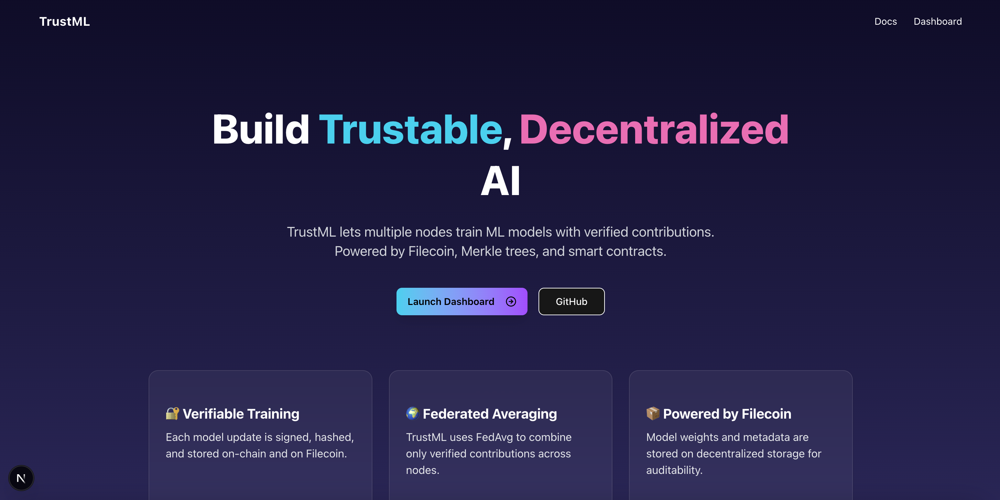

# TrustML

Verifiable Federated Learning with Filecoin

## 🎯 Submission

🎥 Demo video: [link to be added]

🌐 Live App: https://2025-ai-blueprints.vercel.app/

🧾 Filecoin Smart Contract: https://calibration.filfox.info/en/address/0x76C9284988B979f750BC504173ADc08E00c04398

## 🔥 Project Summary

TrustML is a verifiable federated learning platform powered by Filecoin and Akave. It enables trustable, decentralized machine learning by allowing multiple nodes to train locally, submit verifiable updates, and collaborate securely to build a global model.

## 🌐 Problem

In federated learning, multiple participants contribute to a shared model without revealing their raw data. However, there's no way to prove that each participant's update is valid, nor to audit the final model’s lineage.

## 💡 Solution

TrustML solves this by combining:

- Federated Averaging (FedAvg) to merge decentralized model updates
- Digital signatures and hashing to verify integrity of each model update
- Filecoin/Akave to store model weights and metadata
- Smart contracts to store proof of contributions
- Only verified updates are included in the aggregation, ensuring the global model is tamper-resistant and auditable.

## 🔧 Technical Detail

### Filecoin

We used Filecoin to store cryptographic proofs of model updates and task metadata on-chain through a custom smart contract. Each participant’s model submission includes a hash stored on Filecoin, enabling verifiable and auditable federated learning. This aligns with the "Verifiable & Reproducible AI" challenge by ensuring provenance and reproducibility of each training round.

### Akave

We used Akave for decentralized storage of TensorFlow model weights and schemas, supporting fast retrieval for real-time training and aggregation. This usage addresses the "Interoperable AI Data Pipelines" challenge by bridging decentralized storage with standard AI workflows. Our SDK uploads model updates to Akave and retrieves them efficiently during aggregation, ensuring low-latency hot storage for ongoing learning sessions.

### SDK

https://github.com/taijusanagi/2025-ai-blueprints/blob/main/lib/trustml.py

- Supports uploading and downloading TensorFlow neural network schemas and weights via Akave
- Enables creation and submission of federated learning tasks and TensorFlow models with interaction to the Filecoin smart contract
- Performs federated averaging of TensorFlow model weights submitted by participants

### App

https://github.com/taijusanagi/2025-ai-blueprints/blob/main/app/src/app/dashboard/page.tsx

- Visual dashboard for monitoring federated learning sessions
- Fetches task data from the Filecoin smart contract and visualizes schema, accuracy metrics, and model updates
