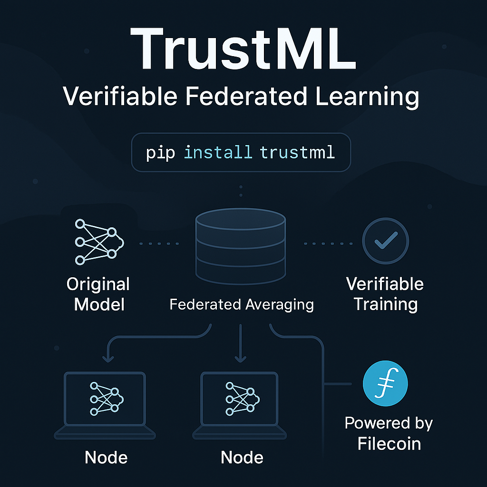

# TrustML

Verifiable Federated Learning with Filecoin

## 🔥 Project Summary

TrustML is a verifiable federated learning platform powered by Filecoin and Akave. It enables trustable, decentralized machine learning by allowing multiple nodes to train locally, submit verifiable updates, and collaborate securely to build a global model.

## 🌐 Problem

In federated learning, multiple participants contribute to a shared model without revealing their raw data. However, there's no way to prove that each participant's update is valid, nor to audit the final model’s lineage.

## 💡 Solution

TrustML solves this by combining:

- Federated Averaging (FedAvg) to merge decentralized model updates
- Digital signatures and hashing to verify integrity of each model update
- Filecoin/Akave to store model weights and metadata
- Smart contracts to store proof of contributions
- Only verified updates are included in the aggregation, ensuring the global model is tamper-resistant and auditable.

## 🎯 Use Case:

- Federated + Verifiable Training

## 🎯 Submission

🎥 Demo video: [link to be added]

🌐 Dashboard: [demo site link]

🧾 Smart Contract: 0x76C9284988B979f750BC504173ADc08E00c04398

🖼 Architecture Diagram: [Included in submission]
